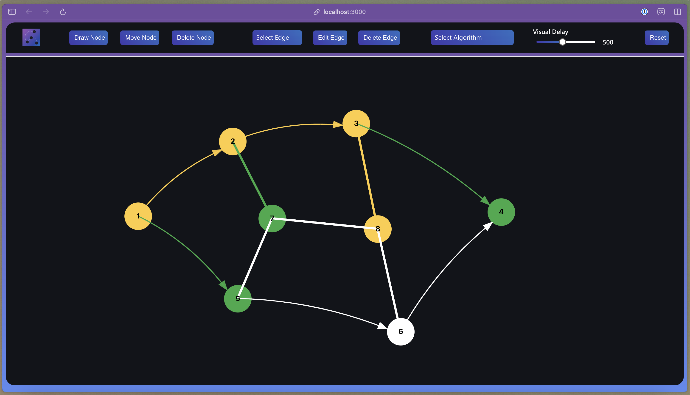

## Graph Algorithm's Visualizer

A web-based interactive tool for visualizing common graph algorithms. Built with React and SVG graphics, which allows to create, manipulate, and analyze graphs while watching algorithms execute in real-time.

## Features

- **Graph Creation and Editing**

  - Draw nodes with click interactions
  - Create both directed and undirected edges
  - Assign weights to edges
  - Move nodes dynamically
  - Delete nodes and edges
  - Edit edge weights

- **Supported Algorithms**

  - Traversal Algorithms
    - Breadth First Search (BFS)
    - Depth First Search (DFS)
    - Minimum Spanning Tree (Prim's Algorithm)
  - Pathfinding Algorithms
    - Dijkstra's Shortest Path

- **Visualization Controls**
  - Adjustable visualization speed
  - Step-by-step algorithm execution
  - Visual feedback for visited nodes and paths
  - Color-coded states for better understanding
